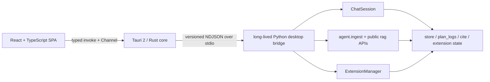

# 第 00 步：凍結範圍、架構與完成定義

## 本文件的用途

這是整套 GUI 計劃的入口與決策基準。本輪只建立計劃，不實作、不安裝依賴、不修改既有程式。

後續實作應逐份執行 `01.md` 到 `18.md`；每完成一份就做該份的驗收並停下，不把整套 GUI 當成一次無界的大改造。

## 已確認的專案本質

- 工作區根目錄：`/home/minervamuses/research-agent-workspace`。
- 唯一 Python/Poetry project 位於 `app/`，同一 distribution 包含 `agent`、`rag`、`skills`。
- 這是學生自用、單機、本地 research agent；優先順序是正確研究流程、可重現、短回饋、可除錯與低維護成本。
- 唯一支援 runtime 是 Linux。當前開發位置是 Ubuntu 24.04 WSL，GUI 預設也在 Linux/WSLg 執行。
- Python runtime 必須是 Conda `app`，不可改用 system Python、`.venv` 或直接 `pip install`。
- `ChatSession` 是 stateful application facade；CLI 是終端 adapter，不是 GUI API。
- Python 必須繼續是 Chroma、`raw.json`、`folder_meta.json`、chat history、plan logs、citation bundles 與 extension registry 的唯一擁有者／寫入者。

## 已確認的現有接縫

| 能力 | 應重用的入口 | 不應重用的入口 |
|---|---|---|
| Chat turn | `ChatSession.turn_outcome()` | `agent.cli.chat._run()` 的 terminal loop |
| Session status | `ChatSession.status_snapshot()` 經 DTO 轉換 | 解析 `/status` 顯示文字 |
| Mode / thinking / skill | session 的明確 methods | 傳 slash command 字串、模擬 `input()` |
| RAG read | `rag.search/explore/list_chunks/get_context` | 直接讀 Chroma SQLite |
| RAG mutation | `agent.ingest` 與 `rag` host APIs | 從 React/Rust 改 `raw.json` |
| Extensions | `ExtensionManager.status/preview/apply` | CLI confirmation handler |
| Shutdown | `flush_recent_turns()` | 直接 kill Python process |

現況另有限制：graph 只有 node/tool 級 update，沒有逐 token streaming；沒有 turn cancel；沒有 LangGraph checkpointer；沒有可恢復的完整 session transcript；bash approval 依賴 TTY；repo ingest 進度目前只是 `print()`。

## 建議的最小架構

### 各層責任

- React：只負責畫面、互動狀態與安全呈現，不接觸 Python objects、shell、secret 或資料庫。
- Tauri/Rust：作為 WebView 的權限邊界，管理 Python process、request correlation、ordered channel、崩潰與 shutdown。
- Python bridge：驗證協定、持有單一 asyncio loop 與單一 active `ChatSession`、序列化 mutation、把既有 Python API 轉成穩定 DTO。
- 現有 domain code：維持 agent、RAG、citation、extension 的既有 ownership 與 safety invariants。

## 為何不選其他方案

- 不包裝 CLI/PTY：CLI 含 human-readable print、TTY `input()` 與 slash picker，拿來當 protocol 會脆弱且可能破壞 bash/citation 邊界。
- 不加 FastAPI/WebSocket：第一版不需要 port、local auth、額外 service 或新的 Python production dependency。
- 不讓 React 直接啟動 shell：Python process 只由 Rust core 管理，WebView 不取得任意 process 權限。
- 不在第一版 bundle Python：現有 Conda、Chroma、Ollama、MCP 與 Linux native dependencies 很重；先完成 source-checkout 本機 GUI，再另評估 target-specific sidecar。
- 不新增 GUI database：目前沒有需要第二個 truth source 的功能。

## 第一版完成範圍

1. 在 WSL/Linux 以正確 Conda runtime 啟動 Tauri 視窗與長駐 Python backend。
2. 單一 live chat session：final answer、安全 Markdown、node/tool activity、錯誤顯示與 graceful flush。
3. Normal/plan、normal/extended thinking、skill/task mode、citation 互斥規則的明確 controls。
4. RAG overview、semantic search、chunk/context 檢視。
5. File/folder ingest、workspace init、sync dry-run、prune preview + 明確確認。
6. Extension status、preview、exact MCP binding approval、apply 與 backend restart。
7. Runtime/Conda/OpenRouter/Ollama/MCP/store diagnostics，只顯示 secret 是否設定，不顯示值。
8. Bash 若完成第 09 步的 injectable approval bridge 才能在 GUI 執行；否則必須明確標示為 unavailable/auto-denied。

## 第一版明確非目標

- Windows native Tauri `.exe` 控制 WSL Python。
- 多使用者、登入、雲端同步、遠端存取、telemetry、HA。
- 多視窗、多 active sessions、可恢復的聊天清單／完整 transcript。
- 逐 token streaming、可靠的 turn cancellation。
- 多 ingest roots、root manifest 或既有 store schema 變更。
- PDF、DOCX、圖片附件或 multimodal ingestion。
- 在 GUI 儲存／回顯 API keys，或新增 keyring。
- 自動修正 issue 02、03、04 的既有技術債。
- Extension hot reload、local-tool plugin system、自動 updater。
- 把 RAG `Hit.score=None` 假裝成可信相似度分數。

## 平台與技術決策

- Tauri 2.x + React + TypeScript + Vite，使用 npm lockfile。
- Tauri 官方建議 SPA frontend 使用 Vite；Rust→frontend 的 ordered stream 使用 Channel，不使用高頻全域 event。
- 檔案／資料夾選擇使用官方 dialog plugin，回傳 Linux path。
- CSP 採 local assets only；不載入 CDN script、remote HTML 或 raw HTML Markdown。
- Phase 1 backend 是既有 Conda `app` 中的 `python -m agent.desktop.server`，不硬編碼個人 Miniconda 路徑。

官方依據：

- [Tauri frontend/Vite 建議](https://v2.tauri.app/start/frontend/)
- [Tauri commands 與 Channels](https://v2.tauri.app/develop/calling-rust/)
- [Tauri trust boundary](https://v2.tauri.app/security/)
- [Tauri CSP](https://v2.tauri.app/security/csp/)
- [Tauri external binary/sidecar 條件](https://v2.tauri.app/develop/sidecar/)

## 實作順序索引

| 文件 | 獨立步驟 | 主要產出 |
|---|---|---|
| `01.md` | UX 與資訊架構 | 畫面、狀態與使用流程契約 |
| `02.md` | 環境／依賴批准 | 可重現的 Linux Tauri toolchain |
| `03.md` | Tauri/React 骨架 | 空殼視窗與最小權限 |
| `04.md` | Wire protocol | 版本化 NDJSON、DTO、error codes |
| `05.md` | Python bridge | application service 與 serialization |
| `06.md` | Rust supervisor | process lifecycle、pending requests、Channel |
| `07.md` | 啟動／診斷／關閉 | readiness 與 graceful flush |
| `08.md` | Chat | transcript、composer、Markdown、busy state |
| `09.md` | Progress／bash approval | 安全工具活動與批准握手 |
| `10.md` | Modes／skills／citation | 既有 session policies 的 GUI controls |
| `11.md` | RAG read UI | overview、search、chunks、context |
| `12.md` | RAG mutation UI | ingest、sync、prune 與 progress |
| `13.md` | Extensions | preview、binding approval、apply、restart |
| `14.md` | Errors／recovery | typed failures、degraded state、logs |
| `15.md` | Security／a11y | CSP、capabilities、privacy、keyboard UX |
| `16.md` | Automated verification | Python/Rust/TS contract tests |
| `17.md` | Real-case acceptance | 最小真實工作流驗收 |
| `18.md` | Linux delivery／future gates | source-run、build 與後續選項 |

## 全案完成定義

- 每項完成範圍都有 user-visible representative case，而不只 unit test。
- 現有 CLI 行為與 Python tests 保持相容。
- 所有 persistent writes 仍由 Python domain code完成。
- App 正常關閉會回報 flush 結果；force quit 會清楚警告可能遺失 recent turns。
- 沒有把不存在的 token stream、cancel、resume、score 或 cross-platform support 寫成已完成。
- Diff 只含該步必要變更；沒有順手重構 citation/RAG/extension 技術債。

