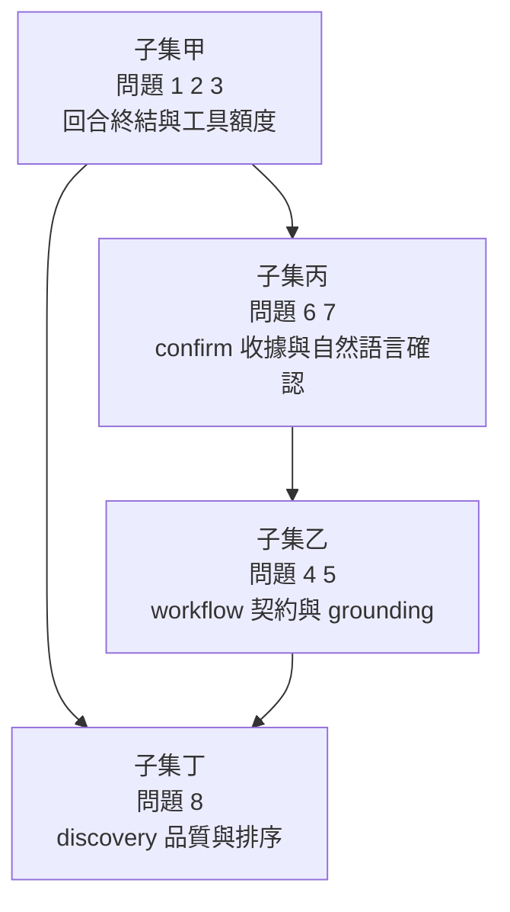

# Minervamuses RESEARCH-AGENT-WORKSPACE 問題盤點與改動計畫深度研究報告

> 歷史研究文件：本文分析的是早期 citation candidate/confirm 架構，並非目前
> `citation_workflow` 的公開契約。現行行為請以 `README.md`、`guide.md` 與
> `app/skills/citation/SKILL.md` 為準。

## 執行摘要

本次研究先以 `prob.md` 為主軸，再回頭交叉比對 `README.md`、`app/` 與 `app/skills/citation/` 實作、既有測試，以及檔案歷史。整體來看，`prob.md` 列出的八個問題不是平均分散的八個獨立缺陷，而是集中在四個技術面向：其一是 **工具額度與回合終結路徑**，其二是 **citation workflow 的公開契約與 grounding**，其三是 **confirm 成功後的收據、gate 封鎖與自然語言確認**，其四是 **discovery 品質、分頁與版本去重**。其中最緊急的不是搜尋品質，而是「成功工具結果被埋沒、回合可能空白結束、模型把未執行工具意圖輸出成普通文字」這類會直接破壞使用者信任與資料正確性的路徑。`prob.md` 本身也是在 2026-07-11 新近更新，commit message 明確寫成「record citation CLI findings from 2026-07-11 live test」，顯示這些問題是剛由實測收斂出的現況，而不是陳年待辦。citeturn4view0turn28view0turn11view0turn13view0

就依賴關係判定而言，我的結論是：**問題 1、2、3 高度互相依賴；問題 6、7 高度互相依賴；問題 4、5 屬於同一類「契約與說明不足」問題，但可在同一批次處理；問題 8 相對獨立，但與問題 3 的 retrieval/分頁策略有弱耦合。** `prob.md` 沒有明文給優先級規則，也沒有團隊人力、時程或 SLA，因此本報告採用的排序假設是：**先修會讓使用者得到錯誤或空白最終答案的缺陷，再修會讓模型誤解系統契約的缺陷，最後修搜尋品質與排序表現。** 這個假設是為了排序方便而加上的合理假設，不是 repo 已明示的規則。citeturn4view0turn7view0

另外，這個 repo 目前 `Issues` 與 `Pull requests` 都是 0，因此本報告的主要證據來源不是 issue tracker，而是 `prob.md`、README/技能指南、主要程式檔與測試檔。換句話說，這份分析是在「沒有正式 issue 討論串可交叉核對」的條件下完成，風險最低的做法就是把每個問題都落回實際程式與測試介面證據。citeturn1view0

下表先給出總覽。

| 子集 | 涵蓋問題 | 依賴判定 | 建議優先級 | 粗估工作量 | 主要理由 |
|---|---|---:|---:|---:|---|
| 執行路徑與工具額度 | 1、2、3 | 高度互依 | 最高 | 中 | 直接造成洩漏工具協定、空白回合與 CLI 誤導，會破壞核心互動流程。 |
| confirm 收據與自然語言確認 | 6、7 | 高度互依 | 最高 | 中高 | 成功 confirm 可能被使用者誤認為失敗，還會導致後續解釋自相矛盾。 |
| workflow 契約與 grounding | 4、5 | 中度互依 | 高 | 中 | 直接影響模型是否會腦補實作、錯誤說明儲存位置，且缺少摘要 grounding 規則。 |
| discovery 品質與排序 | 8 | 弱依賴於 3 | 中 | 中高 | 重要，但比較偏品質提升；不如前兩類那樣會直接弄壞互動結果。 |

判定依據來自 `prob.md` 的問題定義、`graph.py`/`session.py` 的回合與 gate 路徑、`citation/tool.py` 的 action surface、`citation/coordinator.py`/`ranking.py` 的工作流與 fusion 設計，以及既有測試的覆蓋範圍。citeturn4view0turn11view0turn13view0turn18view0turn20view0turn16view0turn16view1turn16view2

## 研究範圍與證據基礎

這個 repository 的主架構是 `app/` 加 `rag/`：`app/` 負責 LangGraph chat agent、CLI、slash commands、skills 與對話記憶；`rag/` 則是獨立的 ingest 與語意搜尋函式庫。README 對 citation skill 的定位非常清楚：它是內建 skill，由 `app/skills/citation/` 目錄同時承載 skill bundle 與 `skills.citation` package；session 內以專屬工具 `citation_workflow` 驅動「搜尋 → 候選 → 選擇 → confirm → 驗證 + 保存」流程。citeturn1view0turn7view0

從檔案樹可以看到，與本次 `prob.md` 最相關的檔案集中在 `app/agent/graph.py`、`app/agent/session.py`、`app/agent/memory.py`、`app/agent/cli/chat.py`，以及 `app/skills/citation/` 之下的 `coordinator.py`、`tool.py`、`gate.py`、`storage.py`、`ranking.py`、`normalize.py`、`SKILL.md`。測試則散落於 `app/tests/`，其中已有 `test_chat_cli.py`、`test_citation_e2e.py`、`test_citation_gate.py`、`test_citation_coordinator.py`、`test_citation_ranking.py` 等，但並沒有獨立命名為 graph/tool-budget/tool-protocol leakage 的測試檔。對 `app/tests/` 目錄做文字查找也看不到 `DSML`、`_cap_tool_calls` 或 `agent_max_tool_interactions` 相關項目。這意味著 repo 確實已有不少 citation 測試，但針對 `prob.md` 新列出的回合終結/額度耗盡類問題，測試面仍是薄弱區。citeturn9view0turn12view0turn10view1turn27view0turn27view1turn27view2

就文件與實作的一致性來看，也能看到一個鮮明特徵：README 已經把 citation skill 的公共契約寫得很完整，例如 `confirm` 重新用 doi.org 驗證、bundle 原子寫入 user-data 目錄、registry 僅是 session 內狀態等；但 skill 的 `SKILL.md` 內容非常精簡，主要只規範「search / present / select / confirm / cite」五步與幾條 hard rules，沒有把資料血緣、儲存位置、`source` action 的用途、或 metadata-only 情境下的說明限制寫進去。這正好對應 `prob.md` 中問題 4 與 5 所描述的現象：模型只看得到 `SKILL.md` 與工具 schema，因此容易在缺少公開契約時自行腦補。citeturn7view0turn30view0turn4view0

## 問題依賴分群與實作排序

### 依賴判定

`prob.md` 並沒有直接標註哪幾題相依、哪幾題獨立，所以如果沒有 repo 證據，原本應採「先假設獨立，只在排序時註明是假設」的處理方式。不過在這個 repo 裡，程式證據已足夠顯示多題是實質耦合的，因此我不採純獨立假設，而是依 code path 分群。citeturn4view0turn11view0turn13view0

| 問題 | 主題 | 是否獨立 | 主要耦合證據 |
|---|---|---|---|
| 1 | 額度耗盡後工具協定洩漏 | 否 | `_cap_tool_calls()` 只裁掉 `tool_calls`，保留 `content`；finalization 只做 citation gate。citeturn11view0turn13view0 |
| 2 | 空回應結束、CLI 顯示像中斷 | 否 | graph 最終答案可為空字串，`finalize_and_record()` 仍會記錄；CLI 直接印出 response，沒有空回應占位。citeturn14view2turn15view2turn23view0 |
| 3 | 候選池/分頁/額度不匹配 | 否 | `MAX_WORKFLOW_CANDIDATES=50`、每頁 10、全域工具額度 4，且 action 列表沒有 `refine`。citeturn20view0turn19view1turn4view0 |
| 4 | 論文介紹缺 grounding | 半獨立 | `show`/detail 只提供 metadata 與 snippet，無 `abstract`/`inspect` action；`SKILL.md` 無 metadata-only 規則。citeturn25view2turn19view1turn30view0 |
| 5 | 錯誤解釋 workflow 實作與儲存位置 | 半獨立 | `source` action 能回 bundle path，但 `SKILL.md` 未講資料血緣/儲存位置，也沒有 `explain`/`receipt` action。citeturn25view1turn30view0turn19view1 |
| 6 | confirm 收據跨 turn 遺失 | 否 | `CitationResult`/`SourceRef` 有 `source_id`、`doi`、`bundle_path`，但 `TurnRecord` 只存最終 answer；gate 失敗時整段以 safe message 取代。citeturn22view0turn23view0turn19view13 |
| 7 | 自然語言確認未映射到 confirm | 否 | `SKILL.md` 只寫「explicitly approves」，沒有同義詞規則；同時 tool surface 只接受 `confirm(identifier=match_id)`。citeturn30view0turn19view3 |
| 8 | discovery 品質與重複候選 | 半獨立 | ranking 只做 identity merge 與 related-version grouping，沒有 venue normalization / tier module；搜尋輸出也不回顯實際年份 filter。citeturn20view0turn29view0turn25view2 |

### 建議實作順序

我建議的順序如下。這個順序不是 repo 原生優先級，而是依「先恢復 deterministic 失敗出口，再處理引用收據正確性，再補透明契約，最後做品質優化」的工程排序假設。citeturn4view0turn7view0



排序理由很直接。若不先修子集甲，後面的 confirm、source、explain、rerank 都可能在空白回合或 budget exhausted 的情況下失真；若不修子集丙，即使底層已成功寫 bundle，使用者仍可能在下一輪被誤導成「其實沒成功」；子集乙雖重要，但主要是降低模型腦補與提升可解釋性，容錯性比前兩類高；子集丁則屬於 correctness 基礎穩定之後的品質層優化。citeturn11view0turn13view0turn24view3turn30view0turn20view0

## 子集甲 執行路徑與工具額度

這一組涵蓋問題 1、2、3。三者共享同一條主幹：`graph.py` 的工具互動上限邏輯、`session.py` 的 finalization/recording，以及 `chat.py` 的 CLI 呈現。從 repo 證據看，它們不是三個獨立 bug，而是同一條回合結束鏈上不同位置的失敗出口不足。citeturn11view0turn13view0turn15view3turn4view0

### 原始問題與根因分析

`agent/graph.py` 裡的 `_cap_tool_calls()` 只做一件事：把 `AIMessage.tool_calls` 裁成 `tool_calls[:remaining]`，但保留原本的 `content=message.content`。因此，如果模型在工具額度耗盡時把下一次工具意圖寫成普通文字，例如 `citation_workflow(action="list", page=5)`，這條路徑根本不會被 `_cap_tool_calls()` 觸碰。接著，`session.py` 的 `_finalize_answer()` 只跑 `check_citations(...)`，只管 citation marker / raw DOI / author-year 等格式，並不檢查 tool-protocol leakage；最後 `_record_turn()` 仍把 `assistant_output=answer` 寫進 `TurnRecord`，而 `TurnRecord` 只有 `user_input` 與 `assistant_output` 兩個主要內容欄位。這正是問題 1 的根因鏈。citeturn11view0turn13view0turn23view0

問題 2 與這條鏈是相同脈絡。`session.py` 在 graph 執行後，直接用 `messages[-1].content if messages else ""` 當 answer，接著又做 `answer = answer or ""`；只要最後一個 AI 訊息 content 是空字串，answer 就會是空字串。後面的 `finalize_and_record()` 不會拒絕空字串，`_record_turn()` 仍會保存；而 CLI 端 `chat.py` 只是做 `response = await session.turn(user_input)` 然後 `print(f"\n{response}\n")`，沒有任何「空回應占位」或「本輪總結失敗」提示。這與 `prob.md` 對問題 2 的描述高度吻合。citeturn14view2turn15view2turn23view0turn4view0

問題 3 是同一條系統設計上的壓力來源。`ranking.py` 把單一 workflow 的 merged candidate cap 固定為 `MAX_WORKFLOW_CANDIDATES = 50`，`coordinator.py` 又把 `PAGE_SIZE = 10`，代表完整掃完五頁才看得到全部候選；但 `prob.md` 已明說每個使用者 turn 僅有 4 次全域工具互動上限，而 `citation/tool.py` 的 action surface 只有 `search`、`more`、`list`、`show`、`select`、`confirm`、`status`、`cancel`、`sources`、`source`，沒有 `refine`。這表示目前的系統鼓勵模型用「逐頁 list」而不是「縮條件後重搜／重排」，設計上天然和 4 次額度衝突。citeturn20view0turn18view0turn19view1turn4view0

現有測試也支持「這裡尚未有專門防線」的判斷。`app/tests/` 目前有 CLI、citation gate、coordinator、provider、ranking 等測試，但找不到 `_cap_tool_calls`、`DSML` 或 tool budget exhaustion 這類關鍵字；`test_chat_cli.py` 也只測 flush、quit、slash command 等，沒有空回應占位行為。citeturn10view1turn16view0turn27view0turn27view1turn27view2

### 變更方向、目標、風險與前置

建議把這個子集一次做成「**失敗出口補齊**」專案，而不是零碎修 bug。具體目標是：

第一，任何 budget exhaustion 都不應讓未執行工具協定進入最終答案。  
第二，任何最終 answer 為空或純空白時，都必須轉為 deterministic placeholder 或一次禁止工具的 repair。  
第三，citation workflow 的候選瀏覽要從「翻頁導向」改成「窄化條件導向」，至少加上 `refine` 或 server-side rerank/filter 能力。citeturn11view0turn13view0turn19view1turn20view0

這一批變更的風險在於：它會改到 `agent/graph.py` 與 `session.py` 這種整個 agent 的核心 chokepoint，若寫得太激進，可能會把合法的普通文字誤判成協定垃圾，或者讓回應變得過度保守。不過前置條件相對簡單，幾乎不需要外部服務配合；真正需要的是新增 graph/session/CLI 的完整回歸測試。就優先級來看，我會把它列為 P0。citeturn11view0turn13view0turn15view3

### 建議實作步驟與最小補丁雛形

先在 `agent/graph.py` 或 `agent/session.py` 新增 tool-protocol artifact 檢查。因為 `_cap_tool_calls()` 的責任本來就只是裁切 `tool_calls`，比較穩妥的做法是：**保留 `_cap_tool_calls()` 的裁切功能，但把「偵測文字型協定殘留」放到 finalization**，避免在 graph 層對模型輸出做太多語義判斷。

```diff
diff --git a/app/agent/session.py b/app/agent/session.py
@@
+import re
@@
+_TOOL_PROTOCOL_RE = re.compile(
+    r"(citation_workflow\s*\(|\baction\s*=\s*[\"'](?:search|list|show|select|confirm|sources?|status|cancel)[\"'])"
+)
+
+def _has_tool_protocol_artifact(text: str) -> bool:
+    return bool(text and _TOOL_PROTOCOL_RE.search(text))
+
     def _finalize_answer(self, answer: str, *, user_input: str) -> tuple[str, list[str]]:
+        if _has_tool_protocol_artifact(answer):
+            return (
+                "（本回合工具額度已耗盡或工具呼叫未完成；我只保留已取得的結果。若需要更多檢索，請縮小條件後再問。）",
+                ["tool_protocol_leakage: stripped non-user-visible tool protocol artifact"],
+            )
         citation_active = self.citation_skill_active
@@
     async def finalize_and_record(...):
         final_text, errors = self._finalize_answer(answer, user_input=user_input)
+        if not final_text.strip():
+            final_text = "（工具結果已取得，但本輪總結失敗；請重試，或把問題縮小成更明確的一步。）"
+            errors = [*errors, "empty_final_answer: replaced with deterministic placeholder"]
         await self._record_turn(...)
```

接著，把 retrieval surface 從「只能翻頁」補成「可窄化」。最小可行版本不必一次做完整 semantic rerank，可以先增加一個 `refine` action，把年份、venue、work type、keyword constraints 對既有 candidate pool 做 deterministic filter/rerank。citeturn19view1turn20view0

```diff
diff --git a/app/skills/citation/tool.py b/app/skills/citation/tool.py
@@
-CitationAction = Literal["search", "more", "list", "show", "select", "confirm", "status", "cancel", "sources", "source"]
+CitationAction = Literal["search", "more", "refine", "list", "show", "select", "confirm", "status", "cancel", "sources", "source"]
@@
- query: str | None = Field(None, description="Search text (search; optional refinement for more).")
+ query: str | None = Field(None, description="Search text (search) or refinement text (more/refine).")
@@
+ if action == "refine":
+     if not (query or "").strip():
+         return _validation_error("action 'refine' requires refinement text")
+     outcome = coordinator.refine(query)
+     return format_search_outcome(outcome, appended=False)
```

然後在 CLI 顯示層補上一個最後保險：即使未來別的路徑仍回傳空字串，CLI 也不應靜默。

```diff
diff --git a/app/agent/cli/chat.py b/app/agent/cli/chat.py
@@
-                print(f"\n{response}\n")
+                if not response.strip():
+                    response = "（本輪沒有可顯示的最終回答；請查看上一段工具輸出或重試。）"
+                print(f"\n{response}\n")
```

### 測試與驗證標準

這一組的驗證要從「文字輸出正確」改成「回合終結條件正確」。建議至少新增以下測試：

| 測試 | 應驗證的結果 | 可擴充既有檔案 |
|---|---|---|
| tool budget exhausted + DSML 字串 | 最終 answer 不含 `citation_workflow(...)` 之類協定殘留 | 新增 `test_graph_budget_exhaustion.py` |
| tool result 後 AI 空 content | `finalize_and_record()` 產生 placeholder，不記空 answer | `test_citation_e2e.py` / 新增 session 測試 |
| 剝除 `tool_calls` 後 content 為空 | 不可直接路由成無聲 END | graph/session 測試 |
| CLI 收到空 response | 顯示清楚占位訊息 | `test_chat_cli.py` |

驗收時，標準不是「模型一定聰明」，而是「不管模型是否犯錯，都不會把工具協定、空白終局或誤導性靜默直接暴露給使用者」。citeturn16view0turn16view1turn11view0turn13view0

## 子集乙 工作流契約與 grounding

這一組涵蓋問題 4、5，我把它定義成 **公開契約不足**。它不一定會立刻害資料錯誤，但會提高模型腦補的概率，而且一旦腦補，使用者看不出哪些敘述是 deterministic workflow 給的、哪些只是模型常識補完。citeturn4view0turn7view0turn30view0

### 原始問題與根因分析

關於問題 4，`citation/tool.py` 的 `show`/detail 輸出其實就是 metadata viewer：會列出 `title`、`authors`、`year`、`venue`、`DOI`、`URL`、`snippet`、provider rank、field provenance 與 conflicts，但沒有 `abstract`、沒有 full text、也沒有任何「這只是 metadata，不是論文內容摘要」的警告。另一方面，tool action list 也沒有 `inspect` 或 `abstract`。這代表當模型回答「這篇論文大意是……」時，如果沒有另外去 Web/RAG/read_file 補查，本質上只能靠標題與 metadata 猜。`prob.md` 把這件事定義成 lack of grounding，是合理而且能從 repo 直接支持的。citeturn25view2turn19view1turn4view0

關於問題 5，repo 的 deterministic 事實其實很完整：`storage.py` 明寫 bundle 是原子寫入 user-data 目錄，絕不在 source tree；`coordinator.py` 在 confirm 成功後會建立 `SourceRef`、設定 `bundle_path` 並註冊到 registry；`tool.py` 也提供 `sources` 與 `source` action，而且 `format_source_detail()` 確實會輸出 `bundle`、`DOI`、`URL` 等 detail。問題在於，skill 的 `SKILL.md` 只寫「`action="sources"` lists this session's saved sources; `action="source"` re-activates one」，並沒有把工作流資料血緣、儲存位置、`source` 應在何時使用寫清楚；action surface 也沒有 `explain`/`receipt` 類工具。這使得模型在面對「存在哪裡」「你怎麼存的」此類問題時，缺乏 deterministic 설명 通道。citeturn21view1turn24view3turn25view1turn30view0turn19view1

### 變更方向、目標、風險與前置

這一組我建議採用「**先把公共契約寫清楚，再決定是否增工具**」的做法。也就是說，第一批改動應該先落在 `app/skills/citation/SKILL.md` 與必要的 tool-facing formatter，而不是一次加入很多新 provider 行為。因為目前最明顯的問題不是 provider 沒能力，而是模型不知道哪些話可以說、哪些必須標註成 metadata-only、哪些問題應走 `source`。citeturn25view2turn30view0

具體目標可分兩條。  
一條是 grounding：當只拿到 metadata 時，模型只能說「根據標題/metadata 推定」，不能說成 grounded summary。  
另一條是 transparency：當使用者問 workflow/data lineage/storage location 時，模型應優先用 deterministic public contract 回答，必要時用 `action="source"` 取 bundle path，而不是用 `bash` 去 source tree 搜目錄。citeturn4view0turn21view1turn25view1

這組的風險比子集甲低，因為多數改動是文件、formatter、或只讀 action；但若新增太多 `abstract`/`inspect` 類 action，會開始牽動 provider hub 與容量設計。我的建議是分兩階段：**先做文件 + explain/receipt；若還需要更深摘要，再進到 provider 擴充。**citeturn18view0turn19view1

### 建議實作步驟與最小補丁雛形

第一步，擴寫 `SKILL.md`，把 metadata-only、source 用途、儲存位置契約直接寫進 skill 內文。這是成本最低、收益最大的修補。citeturn30view0turn21view1

```diff
diff --git a/app/skills/citation/SKILL.md b/app/skills/citation/SKILL.md
@@
 ## Hard rules
@@
 - `action="sources"` lists this session's saved sources; `action="source"` re-activates one for citing.
 - When a search fails or a candidate has no DOI, say so plainly; never substitute unverified data.
+
+## Grounding rules
+- `show` returns candidate metadata, provenance, and possibly a short snippet. It is NOT a grounded abstract by itself.
+- If you only have title/metadata, say explicitly that the description is metadata-based or tentative.
+- If the user asks where a verified citation was saved, prefer `action="source"` (or `action="sources"` first) instead of guessing or scanning the source tree.
+- Verified bundles are user-data artifacts, not source files inside `app/skills/citation/`.
```

第二步，增加一個只讀 `explain` 或 `receipt` action。它不需要動 provider，只需要 deterministic 回傳 workflow/data-lineage 說明，能明顯降低模型在說明內部實作時自由發揮的空間。citeturn19view1turn24view3

```diff
diff --git a/app/skills/citation/tool.py b/app/skills/citation/tool.py
@@
-CitationAction = Literal["search", "more", "list", "show", "select", "confirm", "status", "cancel", "sources", "source"]
+CitationAction = Literal["search", "more", "list", "show", "select", "confirm", "status", "cancel", "sources", "source", "explain"]
@@
+def format_explain_contract() -> str:
+    return "\n".join([
+        "Citation workflow contract:",
+        "- search discovers candidates from providers",
+        "- select resolves confirmable DOI matches",
+        "- confirm re-fetches structured metadata and BibTeX before saving",
+        "- verified bundles are written to the citation output directory, not the source tree",
+        "- use action=source with a source id to inspect a saved source and its bundle path",
+    ])
@@
+    if action == "explain":
+        return format_explain_contract()
```

第三步，對 `show` 的 formatter 加上一段可見的 `grounding:` 標示。這個改動很小，但對模型與使用者都能降低混淆。

```diff
diff --git a/app/skills/citation/tool.py b/app/skills/citation/tool.py
@@
 def format_candidate_detail(candidate: CitationCandidate) -> str:
     lines = [f"Candidate {candidate.candidate_id} (workflow {candidate.workflow_id}):"]
+    lines.append(" grounding: metadata-only unless separately backed by abstract/full text")
```

### 測試與驗證標準

這一組的驗證不能只看「功能有沒有跑」，而要看「模型被允許說的話是否更可控」。建議測試標準如下：

| 驗證項 | 通過條件 |
|---|---|
| `show` 後的回應模板 | 工具 detail 明確標示 metadata-only，不暗示已取得 abstract/full text |
| `source` / `explain` 路徑 | 使用者問保存位置時，agent 能走 deterministic action，而不是必須靠 `bash` 搜 source tree |
| workflow 說明一致性 | 說明內容與 `storage.py`、`coordinator.py` 的實際資料血緣一致：bundle 在 user-data dir、confirm 重新驗證、`source` 可取 bundle path |
| 迴歸保障 | 不破壞既有 `test_citation_e2e.py` 與 `test_citation_coordinator.py` 的 confirm/registry 行為 |

最重要的驗收問題只有兩個：**一，模型還會不會把 metadata 說成摘要；二，模型還會不會把 bundle 說成存在記憶體、或跑去 source tree 掃目錄。** citeturn16view1turn17view1turn21view1turn24view3

## 子集丙 confirm 收據與自然語言確認

這一組涵蓋問題 6、7，是我認為除了子集甲以外最危險的一組。因為它破壞的是 **「已成功寫入」是否能被使用者正確認知**。技術上成功、對話上卻看起來像失敗，這會讓後續一整串對話都建立在錯誤前提上。citeturn4view0turn22view0turn23view0

### 原始問題與根因分析

repo 內部其實已經有完整的 confirm 成功資料。`types.py` 的 `SourceRef` 具有 `source_id`、`doi`、`provenance`、`bundle_path`；`CitationResult` 也有 `accepted_doi`、`source`、`bundle_path`。`coordinator.py` 在 confirm 成功後會把 `bundle_path` 寫回 `source_ref.bundle_path`，註冊到 registry，並回傳 `CitationResult(status="confirmed", accepted_doi=..., source=..., bundle_path=...)`。就底層資料結構來說，收據是存在的，而且資訊很完整。citeturn22view0turn24view3turn24view4

真正的斷點出在 chat 層。`memory.py` 的 `TurnRecord` 只保存 `user_input` 與 `assistant_output`；`session.py` 的 `finalize_and_record()` 會先做 citation gate，若違規就以 `build_safe_message(...)` 取代整個草稿，再把這個 replacement text 寫進 `TurnRecord`。而 `build_safe_message()` 的文案明確寫著「原草稿不會被保存」。這表示：**如果 confirm 已成功，但同輪最終文字含 raw DOI 而被 gate 擋下，成功工具事實仍已發生，可是 prompt-visible 的歷史只剩封鎖訊息。** 這正是 `prob.md` 問題 6 的核心。citeturn23view0turn13view0turn19view13turn4view0

更加微妙的是，這裡還有一個 repo 內部的設計張力：`gate.py` 明寫 raw DOI 在任何可掃描區域都會被 block，測試也驗證了即使 DOI 在 markdown link 裡也一樣會被判為 `raw_doi`；但 `citation/tool.py` 的 `format_result()` 在 confirm 成功時，卻又會直接把 `DOI: {result.accepted_doi}` 與 `bundle: {result.bundle_path}` 放進工具輸出。也就是說，tool 層預設想把成功收據講完整，gate 層卻又禁止最終 answer 直接出現 raw DOI。這不是單純的 LLM失誤，而是 **tool formatter 與 final gate 的政策碰撞**。citeturn19view12turn16view2turn25view1

問題 7 則是這條路徑的前半段。`SKILL.md` 只要求「only after the user explicitly approves a match in a later message, `action="confirm"`」，但沒有列出確認同義詞；tool surface 也只是要求 `confirm(identifier=match_id)`，沒有任何自然語言確認規則。換句話說，**repo 現在把「儲存 / OK / 要這篇 / 就這篇」是否等價於 confirm，完全留給模型自行理解**。這就是為什麼 `prob.md` 會把 7 視為獨立問題，但它在實際互動上幾乎一定會與 6 同時出現。citeturn30view0turn19view3turn4view0

### 變更方向、目標、風險與前置

這組的核心目標不是單純「讓 confirm 更常成功」，而是做到三件事：

其一，**成功的 confirm 事實不可因 gate 而在上下文中消失**。  
其二，**自然語言中的明確認可，若僅有唯一 pending match，應可被穩定映射到 confirm。**  
其三，**confirm 收據的呈現格式必須與 gate 相容，而不是互相衝突。** citeturn22view0turn19view12turn25view1

這組有中高風險，因為會同時碰到 policy、formatter、session 記錄與 prompt 行為。前置上，我建議它排在子集甲之後：先把空白終局與 tool protocol leakage 補齊，再來修 confirm/persistence/receipt，測試比較穩定。citeturn11view0turn13view0

### 建議實作步驟與最小補丁雛形

第一步，是把「成功 confirm 收據」從可丟失的 prose，提升成 session finalization 可辨識的結構化事實。最小可行做法可以不動太多資料結構，而是在 `session.py` 從 `new_messages` 掃描成功的 `citation_workflow` ToolMessage，提取 `source`、`DOI`、`bundle`，若最終 answer 被 gate 擋下，則改寫為 **保留成功事實的 gate-safe receipt**。利用現有 gate 規則可知，inline code 不會被掃描，因此 DOI 可安全包在反引號中。citeturn16view2turn19view12turn19view13

```diff
diff --git a/app/agent/session.py b/app/agent/session.py
@@
+import re
+from langchain_core.messages import ToolMessage
+
+_CONFIRMED_SOURCE_RE = re.compile(r"source:\s+(src-[A-Za-z0-9]+)")
+_CONFIRMED_DOI_RE = re.compile(r"DOI:\s+([^\s]+)")
+_CONFIRMED_BUNDLE_RE = re.compile(r"bundle:\s+(.+)$", re.MULTILINE)
+
+def _extract_confirm_receipt(new_messages: list) -> dict | None:
+    for msg in reversed(new_messages):
+        if isinstance(msg, ToolMessage) and getattr(msg, "name", "") == "citation_workflow":
+            text = getattr(msg, "content", "") or ""
+            if "citation confirmed:" not in text:
+                continue
+            src = _CONFIRMED_SOURCE_RE.search(text)
+            doi = _CONFIRMED_DOI_RE.search(text)
+            bundle = _CONFIRMED_BUNDLE_RE.search(text)
+            return {
+                "source_id": src.group(1) if src else None,
+                "doi": doi.group(1) if doi else None,
+                "bundle": bundle.group(1).strip() if bundle else None,
+            }
+    return None
@@
-        if violations:
+        if violations:
+            receipt = _extract_confirm_receipt(new_messages) if new_messages else None
+            if receipt and receipt.get("source_id"):
+                safe = "\n".join([
+                    "（本輪回應文字未通過 citation 檢查，但 confirm 已成功完成。）",
+                    f"- source: {receipt['source_id']}",
+                    f"- DOI: `{receipt['doi']}`" if receipt.get("doi") else "- DOI: (missing)",
+                    f"- bundle: `{receipt['bundle']}`" if receipt.get("bundle") else "- bundle: (missing)",
+                    f"- cite with [[cite:{receipt['source_id']}]]",
+                ])
+                return safe, errors
             safe = build_safe_message(violations, citation_active=citation_active)
             return safe, errors
```

第二步，是把自然語言確認規則從模糊提示變成明文規範。最低成本做法是先補 `SKILL.md`；更穩妥的做法則是在 session 層加入「只有一個 pending match 時的 acceptance phrase hint」。先給最小補丁如下。citeturn30view0

```diff
diff --git a/app/skills/citation/SKILL.md b/app/skills/citation/SKILL.md
@@
 - Never call `confirm` in the same turn as `select`; the tool refuses it.
+- Treat clear acceptance phrases as confirmation when the intended match is unambiguous, e.g.:
+  "儲存", "保存", "確認", "OK", "可以", "要這篇", "就這篇".
+- Before confirm succeeds, do not print a raw DOI in prose. Refer to candidates/matches only by cX / mX ids.
```

第三步，是修正 tool formatter 與 gate 政策的衝突。若維持 raw DOI 一律禁止，那 `format_result()` 不應再鼓勵直接輸出裸 DOI；至少要把 DOI 包裝成 gate-safe receipt 格式，或在 successful confirm 的最終回覆改由 session 層統一生成。最小版本如下。citeturn19view12turn25view1

```diff
diff --git a/app/skills/citation/tool.py b/app/skills/citation/tool.py
@@
-    if result.accepted_doi:
-        lines.append(f" DOI: {result.accepted_doi}")
+    if result.accepted_doi:
+        lines.append(f" DOI: `{result.accepted_doi}`")
```

### 測試與驗證標準

這一組一定要補端到端測試，而且必須跨 turn。建議至少新增：

| 測試 | 預期結果 | 建議檔案 |
|---|---|---|
| confirm 成功但最終文字含 raw DOI | 最終 answer 仍保留成功收據，不可只剩封鎖訊息 | `test_citation_e2e.py` |
| 使用者輸入「儲存」且只有一個 pending match | agent 走 `confirm`，bundle 被寫入 | `test_citation_e2e.py` |
| 使用者輸入模糊確認且有多個 pending match | agent 不應自行猜測，應要求澄清 | 新增 e2e 測試 |
| 下一輪詢問「你存在哪裡？」 | 可由 `source`/receipt 回答 bundle path，不應自相矛盾 | `test_citation_e2e.py` / session 測試 |

真正的驗收標準不是「模型有沒有剛好說對」，而是 **資料事實是否可跨 gate、跨 turn、跨 prompt window 穩定保留**。citeturn16view1turn25view1turn22view0turn23view0

## 子集丁 discovery 品質與排序

問題 8 我視為最後一批做，但不是因為它不重要，而是因為它偏向 **品質層與 product behavior**，而不是「結果會不會直接錯到使用者面前」的核心穩定性問題。citeturn4view0turn20view0

### 原始問題與根因分析

`ranking.py` 的說明非常清楚：它採 reciprocal-rank fusion，固定 `k=60`，跨 provider 的 merge 只在 **canonical DOI 相同** 或 **同 provider ID 相同** 時才會發生；對沒有 DOI 但疑似相近的結果，只會做 **related-version group**，而且是非破壞性的，preprint 與 published 仍會分開列出。這個設計很保守，很適合作 deterministic identity merge，但確實沒有處理「同題異義」「venue 品質分層」「query-title parody」這類 relevance 問題。citeturn20view0

此外，repo 目前只有 `normalize.py` 處理 title normalization，沒有對 venue 做對等級的 normalization/helper；`tool.py` 的 search/candidate formatter 會顯示 `venue` 與 `providers`，但沒有 tier/allowlist 訊息。這表示像 `prob.md` 提到的 SSRN / IEEE Access / FPGA 2025 混排情境，在系統層目前無法被 deterministic 地標註級別。若讓模型自行解讀 venue 字串，質量自然會不穩。citeturn29view0turn25view2turn4view0

年份範圍失配則是另一個層次。`PublishedDateFilter` 的 `within_years()` 與 `from_year_range()` 已在型別層做出嚴謹時間窗，`coordinator.search()` 也會把 date filter 下推給 provider，最後再做 fail-closed post-filter；`status()` 甚至能回傳 `date_filter.describe()`。但 `format_search_outcome()` 並不把實際使用的年份條件回顯給 LLM/使用者，只會說找到幾筆、哪些 provider 狀態、掉了幾筆 date-filtered candidates。這讓模型在寫自然語言摘要時，仍有空間把「近三年」誤述成別的範圍。換句話說，年份 filter 在計算層是對的，在說明層卻沒有被強制保留。citeturn22view0turn18view0turn25view2

### 變更方向、目標、風險與前置

這組我建議拆成兩段：先做 **可解釋性與 deterministic 標示**，再做 relevance 提升。因為在沒有明確 benchmark 與 venue tier 資料來源之前，直接把 reranker 做重會很容易讓系統行為變得更不透明。citeturn20view0turn29view0

短期目標應該是：

一，把實際年份 filter 直接回顯到 search 回覆裡。  
二，把 related-version group 與 duplicate/reprint 關係呈現得更明確。  
三，建立 venue normalization / tier allowlist 的明確資料結構，而不是讓模型臨場自由判讀。  
四，若要補 relevance，優先做 deterministic rerank/filter，再考慮更昂貴的 semantic reranker。citeturn20view0turn25view2turn4view0

風險主要有兩類。一類是資料治理：conference tier/allowlist 需要可維護資料來源，repo 目前沒有現成規格。另一類是排序副作用：若把過多 heuristic 疊進 fusion，可能讓本來 deterministic 的 identity merge 變得難以解釋。因此我會把它列為 P1/P2 之間，排在子集甲與丙之後。citeturn20view0turn29view0

### 建議實作步驟與最小補丁雛形

第一步先補「說清楚」。即便 search 邏輯不變，也要把實際日期窗帶回 `SearchOutcome` 與 formatter，避免模型把 `2023–2026` 講成 `2022–2025`。citeturn22view0turn18view0turn25view2

```diff
diff --git a/app/skills/citation/coordinator.py b/app/skills/citation/coordinator.py
@@
 @dataclass
 class SearchOutcome:
@@
     date_filtered_out: int = 0
+    applied_date_filter: str = "none"
@@
     return SearchOutcome(
         candidates=list(self._candidates),
         provider_states=states,
         used_web_fallback=used_web,
         queries=queries,
         date_filtered_out=filtered_out,
+        applied_date_filter=self._date_filter.describe() if self._date_filter else "none",
     )
```

```diff
diff --git a/app/skills/citation/tool.py b/app/skills/citation/tool.py
@@
 def format_search_outcome(outcome: SearchOutcome, *, appended: bool = False) -> str:
@@
+    lines.append(f"applied date filter: {outcome.applied_date_filter}")
```

第二步，建立 venue tier 模組，不一定立刻拿來 hard-filter，但至少先 deterministic 標註。這樣使用者與模型都能看到「這是 allowlist tier 判定，不是臨場猜測」。下面是最小雛形。citeturn29view0turn25view2

```diff
diff --git a/app/skills/citation/venue_tiers.py b/app/skills/citation/venue_tiers.py
new file mode 100644
+TOP_TIER_VENUES = {
+    "fpga": "A",
+    "isca": "A",
+    "micro": "A",
+    "asplos": "A",
+    "dac": "A",
+}
+
+def normalize_venue_name(raw: str | None) -> str:
+    if not raw:
+        return ""
+    return "".join(ch.lower() for ch in raw if ch.isalnum())
+
+def venue_tier(raw: str | None) -> str | None:
+    key = normalize_venue_name(raw)
+    return TOP_TIER_VENUES.get(key)
```

第三步，再做真正對問題 8 有感的 retrieval 行為修正：新增 `refine` 與 canonical-work grouping，讓使用者縮條件時不用被迫逐頁掃描。這部分與子集甲的 `refine` 建議相連，因此我把它當作弱相依：先把 action surface 補齊，再來調整 ranking 行為。citeturn19view1turn20view0turn4view0

### 測試與驗證標準

這組的測試應該從「內容對不對」拆成「排序是否可解釋」。建議至少驗：

| 測試 | 驗收條件 |
|---|---|
| 年份範圍回顯 | search 結果必須明示實際 `applied date filter` |
| related-version grouping | 同題 preprint/published 能被群組顯示，但不錯誤合併為同一作品 |
| venue tier 標註 | allowlist 內 venue 被 deterministic 標示；不在 allowlist 的 venue 保持未標示，而不是猜測 |
| refine 行為 | 使用者縮條件時，不需要靠多輪 `list page=N` 才能得到更窄 shortlist |

如果要再往前走到 reranking benchmark，repo 已有 `test_citation_ranking_benchmark.py`，可以把這類品質回歸納入同一條測試流水線；但在缺乏明確標註集之前，我會把 benchmark 視為第二階段工作。citeturn10view1turn20view0

## 綜合建議與落地順序總表

最後把四個子集壓成一張實施表。這張表的優先順序，建立在本報告前述假設之上：第一優先是避免錯誤/空白最終答案，第二優先是保住 confirm 成功事實，第三優先才是讓模型更不會腦補，第四優先才是改善候選品質。repo 並未提供正式 priority rubric，因此這是本研究的工程判斷，而不是專案既定政策。citeturn4view0turn7view0

| 順序 | 子集 | 建議處理問題 | 主要檔案 | 風險 | 估計 effort |
|---|---|---|---|---|---|
| 第一批 | 執行路徑與工具額度 | 1、2、3 | `app/agent/graph.py`、`app/agent/session.py`、`app/agent/cli/chat.py`、`app/skills/citation/tool.py` | 中 | 2–4 天 |
| 第二批 | confirm 收據與自然語言確認 | 6、7 | `app/agent/session.py`、`app/skills/citation/tool.py`、`app/skills/citation/SKILL.md` | 中高 | 3–5 天 |
| 第三批 | workflow 契約與 grounding | 4、5 | `app/skills/citation/SKILL.md`、`app/skills/citation/tool.py`、必要時新增 `explain` | 中低 | 2–3 天 |
| 第四批 | discovery 品質與排序 | 8 | `app/skills/citation/ranking.py`、`normalize.py`、新增 venue tier module、`tool.py` | 中高 | 4–7 天 |

如果只允許先做一件事，我會選第一批；如果允許連做兩批，我會做第一批加第二批。理由很簡單：第一批修的是「不要把系統錯誤直接露給使用者」，第二批修的是「不要把成功結果講成失敗」。這兩類問題只要存在，後面的摘要 grounding、workflow 解釋、venue 分層，即使做對了，也很容易被更前面的錯誤互動淹沒。citeturn11view0turn13view0turn19view13turn24view3
